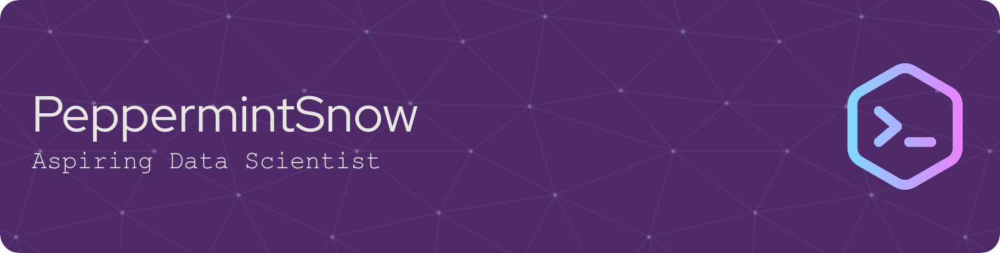

 

 
 

I am **@PeppermintSnow**, an undergraduate of BS Computer Science who has a keen interest for Data Science. 
I am looking to specialize in Machine Learning and AI!

  
  
    

  

<!---
PeppermintSnow/PeppermintSnow is a ✨ special ✨ repository because its `README.md` (this file) appears on your GitHub profile.
You can click the Preview link to take a look at your changes.
--->
